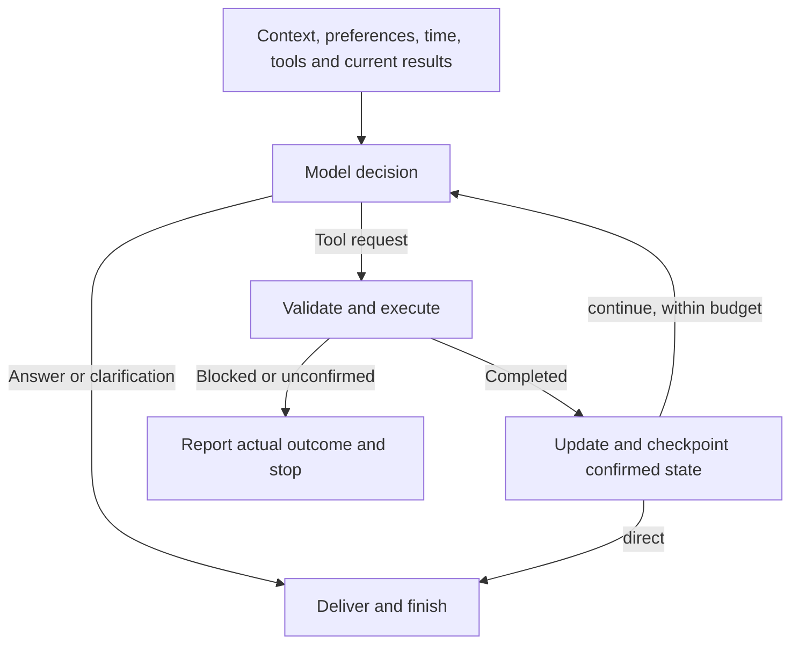

# Personal Assistant with Hybrid LLM Architecture

A personal AI assistant built on Hermes Agent, with GPT by default and Local Gemma for explicit privacy/offline requests or provider failures, Gmail summaries, Google Calendar and local reminders, Telegram conversations and persistent preferences.

The project owns routing, workflows and conversation state. Hermes owns model execution, model authentication and message delivery. Application code runs in **WSL Ubuntu with Python 3.11**; Google Calendar uses Google's official Python client and OAuth libraries.

## Start using it

The existing machine already has Hermes profiles and account credentials. After updating an existing checkout to the current source layout, run `~/.hermes/bin/uv sync --locked` once in WSL to refresh the editable installation and command. From a **WSL terminal**:

```bash
cd /mnt/d/ai_agent_projects/hw3
source .venv/bin/activate
systemctl --user start hw3-ollama
hybrid-assistant --help
hybrid-assistant chat --new "用两句话解释 Python 列表和元组的区别。"
hybrid-assistant chat "第二种适合什么情况？"
```

To receive messages from the configured Telegram private chat:

```bash
hybrid-assistant telegram
```

Keep that process running; Ctrl+C stops it. `hw3-ollama` is the Ollama service name; `gemma4:e4b-it-qat` is the model. Model calls start on demand. The daily briefing uses a separate scheduled job.

For a new machine, install Hermes separately, create the project environment with Python 3.11 and run `uv sync --locked`. Configure the `hw3-openai`, `hw3-nim` and `hw3-local` Hermes profiles under `~/.hermes/profiles/`, using the non-secret templates in `config/hermes/`. Gmail and Telegram credentials belong in the Local profile, following `config/gmail.example.json` and `config/telegram.env.example`; keep credentials outside the checkout. Google Calendar uses a separate desktop OAuth flow described below; Gmail continues to use IMAP.

## Commands and implemented features

| Command | Behavior |
| --- | --- |
| `chat "message"` | Contextual chat, Gmail queries, calendar operations and preference updates |
| `telegram` | Receive and reply to the configured user's private chat |
| `gmail` | Summarize the latest INBOX email using GPT with Local fallback |
| `gmail --limit 3` | Summarize up to three emails; `--subject "text"` filters first |
| `gmail --daily` | Summarize all INBOX arrivals in the preceding 24 hours |
| `calendar reminders` | Sync the configured calendar and preview due reminders |
| `calendar reminders --send` | Send one due batch to the bound Telegram chat |
| `calendar reminders --send --watch` | Keep checking every 30 seconds in the foreground |
| `calendar reminders --status` | Inspect reminder delivery status counts |
| `memory "request"` | Add, change or remove a persistent preference; GPT by default, `--private` for Local |
| `calendar config/calendar.example.json` | Summarize selected events from a local JSON file |

Prefix each command with `hybrid-assistant`. From the repository root, `python src/main.py` provides the same subcommands. Use a subcommand's `--help` for its options. Gmail previews by default; `--send` delivers to Telegram. `--quiet` requires `--send` and hides summary content from command output.

Examples:

```bash
hybrid-assistant chat "总结上周主题包含面试的邮件，最多3封。"
hybrid-assistant chat "第二封要求我做什么？"
hybrid-assistant chat "那改成昨天的。"
hybrid-assistant chat --private "请根据我的偏好解释这个概念。"
hybrid-assistant chat "请记住邮件摘要用中文，并总结最新一封主题含周报的邮件。"
hybrid-assistant gmail --subject "课程通知" --limit 3
hybrid-assistant chat "明天下午三点提醒我交报告。"
hybrid-assistant chat "改到同一天下午四点。"
hybrid-assistant chat "提前半小时提醒，日程时间不变。"
hybrid-assistant chat "明天有哪些日程？"
hybrid-assistant calendar config/calendar.example.json --date 2026-09-08 --timezone America/Los_Angeles
```

The `memory` command and recognized long-term preferences in chat **change the real USER.md** and show the committed diff. The decision model recognizes clear preferences such as “I usually prefer short explanations,” without requiring a fixed “remember this” phrase. It is instructed to exclude one-off answer instructions, ordinary biographical details and email contents; model mistakes can still cause an unnecessary preference update.

## Routing and privacy

| Input | First decision | Later decisions / memory update |
| --- | --- | --- |
| Default conversation, email or calendar data | GPT | GPT |
| Explicit /private, --private, or cloud restriction | Local | Local |
| Offline request | Local | Local; remote data retrieval disabled |
| GPT connection/provider failure | Local fallback | Local for the remaining request; later requests try GPT again |

Trusted privacy and offline restrictions apply before the first model call. Every request receives bounded conversation context, explicit saved preferences, the current time and tool instructions. Email/calendar data does not itself force Local, and complexity no longer automatically selects NIM. The NIM adapter remains available but is outside the default route. All Chat and Telegram model providers disable implicit Hermes profile context; the application supplies bounded preferences as reference data. Model output cannot loosen explicit privacy restrictions.

CLI and Telegram keep separate recent conversations. Explicit private requests lock their conversation to Local until chat --new or Telegram /new. Availability fallback does not set this lock. Resetting a conversation preserves saved events and long-term preferences.

The decision module `app/decision.py` exposes `decide_next_step()`, returning a `StepDecision`. Its `branch` is `DecisionBranch.ANSWER`, `EMAIL` or `CALENDAR`; `provider` records the provider that produced the decision. One provider mapping serves every loop step and optional memory update.

Chat and Telegram share a bounded decision loop. Each model step returns exactly six JSON fields: `answer`, `tool_request`, `memory_request`, `complexity`, `needs_private_context` and `calendar_goal`. Exactly one of `answer` and `tool_request` is non-null. A tool request contains `name` (`email` or `calendar`), validated `arguments` and `result_mode` (`direct` or `continue`). The model can answer, clarify, or request one tool at each step. Completed results can return to the same decision node for another tool request or an answer.



| Path | Typical decision calls, excluding optional memory and provider fallback |
| --- | --- |
| Direct answer or snapshot follow-up | 1 |
| Tool with `result_mode=direct` | 1 |
| Read then interpret | 2 |
| Discover a calendar target, then update/cancel | 2 with a direct receipt; 3 with a generated answer |

The default limits are five decisions, four business-tool calls and a 240-second soft deadline per message. The deadline is checked before starting further work; it does not interrupt an in-flight model or tool call. Calls retain their existing transport timeouts. A request can read more than once but can perform at most one calendar write. Unchanged tool calls are blocked; repeating a read after a confirmed write is permitted for verification. Exhausted budgets or subsequent model failures return available factual receipts without replaying tools.

The model chooses `direct` only when the fixed Chinese result rendering satisfies the whole request and relevant preferences. Email rendering lists query scope, source numbers, senders and subjects, without body content. Calendar rendering provides a list or receipt with event times, duration, location and reminder state, hiding internal IDs and versions. Summaries, comparisons, English replies, custom formats and intermediate target searches use `continue`. There is no extra model that chooses this mode and no final-only synthesis stage.

`calendar_goal` records the original calendar purpose (`query`, `create`, `update`, `cancel`, or null) and is locked after the first decision. A later calendar write must match that purpose. For an update/cancel target search, Python retains the requested date range but sets title text to null and the limit to ten. This prevents a literal title filter from hiding candidates before the model sees them. The next decision receives those candidates, the original user description, and both requested and executed arguments. It may select a sufficiently supported target or ask for clarification; approximate wording does not guarantee a match. Calendar versions and target IDs are still checked by code and the source adapter.

The application distinguishes completed, not-executed and unconfirmed results from historical snapshots. Blocked and failed operations stop with a factual receipt; uncertain writes are never automatically replayed. Every successful tool result updates the working set and is checkpointed before another model call. This preserves confirmed results and new event versions even if later inference fails or is interrupted. If saving fails, the response retains the confirmed receipt and reports that conversation state was not saved. Direct replies and stopped-loop replies share receipt selection: each requested query scope and result stays in order, along with confirmed calendar-write receipts and any failure details. Intermediate calendar reads used to locate a write target are omitted from the final write receipt. Email source headers and memory diffs remain program-rendered. Model decisions and wording can still be wrong and are not independently reviewed by another model.

Each conversation retains its latest email query and numbered results. Calendar context keeps up to ten known records, updating individual IDs/versions after a mutation, alongside the last operation receipt. A new calendar query replaces this working set, including an empty query. These are contextual snapshots; writes still verify the current source version.

An independent optional `memory_request` carries the current user's clearly expressed long-term preference or edit, so one message can update memory and still ask a question or query mail. Memory uses one separate update-model call through the selected route plus deterministic patch validation; there is no separate semantic-equivalence check, and limited wording-only updates are acceptable. The first decision already follows the current message's new preferences when drafting a direct answer. The handler then attempts the memory update before delivering that answer, without asking the model to rewrite it. Memory runs at most once per message. When an update completes, the next decision rereads the saved preferences; a failed update does not prevent following the current message's preferences for that turn. Only the program reports the actual save outcome, even if a later query or decision fails. A memory failure does not cancel the remaining request.

Email scope is structured data, not a new task label for every phrase. Queries support subject text, paired received-time bounds and a count (default 5, maximum 10). Dates use America/Los_Angeles with an inclusive start and exclusive end. Results follow descending INBOX UID order; one extra matching UID (and received time when filtered) is checked without fetching its body, so the reply can disclose incomplete results. The shared history remains at most 6 exchanges / 12,000 characters; all saved email bodies share a 16,000-character budget including truncation notices. Conversation files are read and written only in the current version 5 format. Loading validates fields, types and size limits; saving writes a temporary file and atomically replaces the stored file. Unversioned files, earlier versions and unknown versions are rejected without overwriting them or silently starting a public session. Existing version 5 files continue to work unchanged. Older files require a separate conversion if their contents must be retained; otherwise explicitly start a new conversation with `chat --new "message"` or Telegram `/new`. Automatic development-format migrations are not part of this release.

## Repository structure

```text
src/
  main.py               # python src/main.py; shares the hybrid-assistant CLI
  cli/                  # chat, telegram, gmail, memory, calendar commands
  app/                  # handler, decision, conversation and runtime wiring
  core/                 # deterministic routing and provider execution
  features/             # email, calendar, briefing and memory workflows
  adapters/             # Hermes, Gmail and Telegram integration
config/                 # non-secret examples and installation templates
scripts/                # Windows / Hermes daily scheduling installers and runner
examples/gmail_summary.py # compatibility entry for an already installed daily job
```

The five packages live directly under `src/`, without an outer `hybrid_assistant` package. They are installed together and exposed through `hybrid-assistant`. The remaining `examples/gmail_summary.py` forwards to the Gmail command because the existing external launcher still refers to that path. New schedule installations use the installed command. Hardcoded demonstration scripts and the standalone intent-preview command were removed; their reusable workflows remain, with relevant automated tests kept locally.

## Current boundaries

- Calendar operations require a bound Google calendar. Single timed events and standalone reminders are supported; recurring/all-day events and invitations are not.
- Reminders require the foreground checking command to be running. Late reminders are eligible for up to 15 minutes; older ones expire. Confirmed sends are not repeated, and uncertain outcomes require manual inspection. This is not a guarantee of exactly-once delivery.
- Chat email queries support subject text, received dates and up to 10 results. Sender filters, semantic body search and larger chat result sets need clarification or a narrower request; natural-language parsing can still be wrong, so check the displayed query scope.
- The standalone Gmail command retains its single-email, batch and daily workflows, including per-email summaries. Chat uses a shared answer over its bounded result set.
- Daily reports and chat context remain separate. A pushed daily report is not automatically available for follow-up questions.
- The Telegram receiver runs in the foreground; background service operation has not been added.
- An 08:00 America/Los_Angeles schedule is installed. Check its actual enabled state before expecting delivery; the review observed the Windows task disabled and left it unchanged.
- Generated decisions, query ranges and answers can be wrong. Tests verify routing, state and failure behavior, not arbitrary model factual accuracy.

## Verify

In the activated WSL project environment, including a fresh GitHub checkout:

```bash
python -m ruff check .
python -m ruff format --check .
~/.hermes/bin/uv lock --check
```

The automated tests and internal working documents stay local and are excluded from publication. Maintainers with the local suite can run `python -m pytest -q`; these tests use temporary data and injected transports, without sending real messages.

## Google Calendar and reminders

Google Calendar is the only event source for chat and reminders. Bind a Google calendar before using these features; missing configuration produces a setup message. Offline mode and Google errors never switch to a local calendar.

Create a Google Cloud project, enable **Google Calendar API**, configure Google Auth Platform, and create a **Desktop app** OAuth client. If the OAuth app is in Testing, add your own Google account as a test user. Download the client JSON outside the checkout. Follow [Google's Python setup guide](https://developers.google.com/workspace/calendar/api/quickstart/python).

In an activated **WSL terminal**, authorize and create a dedicated calendar:

```bash
hybrid-assistant calendar google auth --client-secrets /mnt/c/Users/YOUR_USER/Downloads/YOUR_CLIENT.json
# Open the printed URL in the browser on this computer and complete Google consent.
hybrid-assistant calendar google connect --name "AI 助手"
hybrid-assistant calendar google status
```

The default OAuth scope is `calendar.app.created`: create secondary calendars and manage their events. To bind a calendar you already own, use `auth --existing --client-secrets ...`, then `connect --calendar-id YOUR_CALENDAR_ID`; this requests owned-event access plus read-only calendar metadata. Connection commands do not overwrite an existing binding or create duplicate calendars on retry. If creation has an uncertain result, inspect Google first and bind its actual ID.

The browser callback listens only on loopback port 8765 for up to five minutes; `auth --port 8766` can select another port. OAuth credentials and configuration are stored privately under `~/.hermes/profiles/hw3-local/google-calendar/`. Expired/revoked authorization produces a clear error; rerun `auth` to reauthorize the same account with the same scope option. External OAuth apps left in Testing may have refresh tokens expire after seven days; see [Google's token expiration rules](https://developers.google.com/identity/protocols/oauth2#expiration).

Chat and Telegram support structured `query`, `create`, `update` and `cancel`. Dates use America/Los_Angeles by default; explicitly requested IANA timezones are supported. Queries filter event start times, include the lower bound, exclude the upper bound, and return up to 10 records with optional literal title matching.

```bash
hybrid-assistant chat --private --new "明天下午三点提醒我交报告。"
hybrid-assistant chat "改到同一天下午四点，提前半小时提醒。"
hybrid-assistant chat "取消刚才的交报告日程。"
hybrid-assistant calendar google query --from 2030-01-02T00:00:00-08:00 --until 2030-01-03T00:00:00-08:00
```

The Google query command reads directly without a model; replace its example dates with the range to inspect. Updates/cancellations require a known source-bound event ID and version. The adapter checks Google's ETag both on reading and through `If-Match` on writing. Requery after a conflict. It patches only requested fields and preserves unrelated event data. New events use private visibility; this controls calendar sharing, separately from model routing. `/new` clears conversation snapshots while retaining saved events and preferences.

Meetings need an explicit duration. A standalone reminder uses duration zero inside the assistant; Google represents it as one minute marked free, with a private marker preserving the reminder meaning. One explicit popup reminder is also used as the Telegram reminder lead. Google's default calendar notifications are not automatically mirrored to Telegram. Recurring/all-day/special events and multiple/email reminder settings are not handled; queries disclose omitted records. Events with attendees can be read if otherwise supported, but this version does not modify/cancel them or send invitations.

To send reminders, keep a separate foreground command running:

```bash
hybrid-assistant calendar reminders
hybrid-assistant calendar reminders --send
hybrid-assistant calendar reminders --send --watch
hybrid-assistant calendar reminders --status
```

Preview refreshes Google's local reminder cache but sends nothing. Sending checks Google first, reconciles edits/cancellations, then rereads each due event immediately before claiming it. Unsupported records are reported and do not block other supported reminders. Sync failures prevent sending from stale data. External edits can still race after the final check; Google and Telegram do not share an atomic transaction.

The dedicated `adapters/reminder_ledger.py` stores per-calendar delivery state in SQLite. It has no event creation, editing, cancellation or calendar-query interface. The ledger uses version 2 and stores opaque event versions as text. New ledgers are initialized directly in this format; unsupported formats are rejected without conversion. The checker covers the maximum 28-day reminder lead, processes at most 10 due reminders per batch, and accepts reminders up to 15 minutes late. It records attempts before sending, preserves sent/uncertain states across metadata changes, and never automatically retries uncertain deliveries. Delivery still requires WSL and the checking process to remain running; no background service is installed.

The decision model receives each known event's start, end, duration and other fields. For a create/update it computes and returns the complete proposed event, including starts_at, ends_at and duration_minutes. Python checks that all fields are valid and that end minus start equals duration; it rejects missing or inconsistent proposals rather than calculating a replacement. It verifies the target/version and writes actual changed fields. A `direct` request renders the confirmed result without another model call; `continue` passes the result back to the decision loop, which can answer, clarify or request another permitted tool. Reminder checking and delivery require no model. GPT handles these requests by default; --private selects Local. --offline blocks Google access and never writes to an alternative calendar.

The `calendar config/calendar.example.json` entry remains a read-only file briefing, separate from calendar management. Credentials, calendar data, internal docs and tests stay local.
