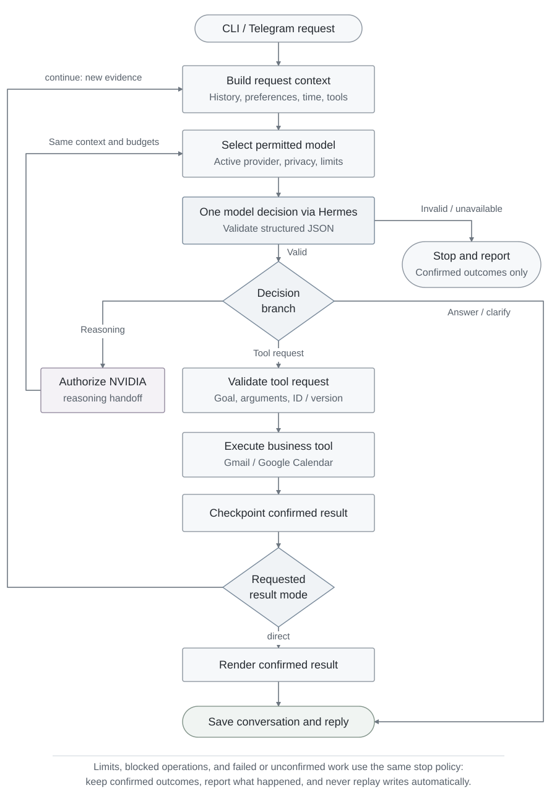
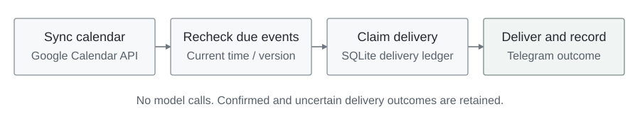

# Personal Assistant with Hybrid LLM Architecture

A self-hosted, single-user AI agent for **Gmail, Google Calendar, and Telegram**. It turns natural-language requests into validated actions, remembers conversation context and user preferences, and combines GPT, NVIDIA Nemotron reasoning, and local inference with persistent model selection across follow-ups.

Built in Python with an explicit **branch-and-loop workflow**: the model decides what to do next; application code controls what can actually execute. Runs from the terminal or a Telegram private chat on WSL2 / Linux.

## What it does

| Capability | Example |
| --- | --- |
| Email search, summaries, and follow-ups | “Summarize last week's emails with interview in the subject.” → “What does the second one ask me to do?” |
| Calendar management | “Create a 30-minute discussion tomorrow at 4 PM.” → “Move it to 5 PM.” → “Cancel it.” |
| Adaptive reasoning | Delegate difficult planning to NVIDIA Nemotron, then refine the answer with the same model across follow-ups. |
| Multi-step tool use | “Check tomorrow for project reviews; if there are none, check the following day.” |
| Persistent preferences | “I usually prefer short explanations.” → applied across later conversations |
| Scheduled notifications | Telegram reminders for calendar events, plus a separate daily email briefing command |

**Tech stack:** Python 3.11 · Hermes Agent · GPT · NVIDIA Nemotron / NIM · Gemma / Ollama · Google Calendar API / OAuth 2.0 · Gmail IMAP over TLS · Telegram Bot API · SQLite · uv · pytest · Ruff.

## Workflow

The same loop handles answers, tool use, and reasoning handoffs. It combines conversation context, saved preferences, the current time, and tool contracts. Each iteration produces one structured decision, validated by the application.

<picture>
  <source media="(prefers-color-scheme: dark)" srcset="assets/workflow-dark.svg">
  <source media="(prefers-color-scheme: light)" srcset="assets/workflow.svg">
  
</picture>

- **Tool loop:** `continue` feeds results back into the decision; `direct` delivers confirmed results immediately. The agent can look up events, resolve an approximate description, and request a validated change.
- **Reasoning branch:** `delegate_reasoning` hands the next decision to NVIDIA while preserving context, tool results, the original calendar goal, and remaining budgets. NVIDIA can use the same tools.
- **Execution limits:** each request allows 5 decisions, 4 business-tool calls, one calendar write, one preference update, and one reasoning handoff. A 240-second soft deadline is checked between steps. Confirmed actions are retained if later work fails; writes are never replayed automatically.

Preference editing runs only when needed, with a separate model call and validated atomic save. A failure to save a preference does not cancel independent work. Limits, blocked operations, and failed or unconfirmed work share the same stop policy shown above.

**Independent reminder worker**

Calendar reminders run separately from the interactive decision loop, without model calls.

<picture>
  <source media="(prefers-color-scheme: dark)" srcset="assets/reminder-workflow-dark.svg">
  <source media="(prefers-color-scheme: light)" srcset="assets/reminder-workflow.svg">
  
</picture>

### Model roles and continuity

| Model | When it runs | On provider failure |
| --- | --- | --- |
| **GPT** | Starts new public conversations and handles routine reasoning and tools | Fall back to Local |
| **NVIDIA Nemotron** | Takes an approved reasoning handoff; continues handling follow-up messages | Fall back to GPT, then Local |
| **Local Gemma / Ollama** | Handles private or offline requests, or cloud-provider fallback | No cloud fallback |

The actual provider of a successful main decision becomes the conversation's `active_provider`. Follow-ups reuse it; a provider fallback is announced and retained. **Privacy rules override every cloud route.** `/new` (or `chat --new`) clears recent context and private mode, restores GPT, and keeps saved preferences and calendar events. Manual model-switch commands are not implemented. Invalid decision JSON stops the request; fallback handles provider failures, not answer repair.

## Engineering highlights

| Design | Implementation and benefit |
| --- | --- |
| **Controlled multi-model execution** | Model-proposed reasoning delegation, deterministic privacy policy, provider fallback, and persistent model selection within one bounded loop. |
| **Validated side effects** | Strict JSON contracts, typed requests, a locked calendar goal, and timezone/DST/duration checks before execution. |
| **Optimistic concurrency control** | Calendar updates and cancellations reread the target and use Google ETags with `If-Match` to reject stale writes. |
| **Context and durable memory** | Bounded conversation snapshots, checkpoints after successful tools, file locks, and atomic saves. Preferences use validated add/replace/remove patches with actual change receipts. |
| **Accountable delivery** | Bound Telegram user/chat IDs, a single-instance receiver, persistent offsets, and a transactional SQLite reminder ledger. Uncertain sends are not automatically replayed. |
| **Execution diagnostics** | CLI and Telegram logs expose parsed decision providers, decision/tool counts, and stop reasons for inspecting the executed path. |

### What this project implements

To make agent internals easier to study and extend, this project implements the **decision loop, routing policy, context assembly, preference editing, Gmail/Calendar tools, Telegram intake, and reminder state** as small Python modules. These responsibilities are inspired by capabilities available in Hermes and implemented in the application itself.

[Hermes Agent](https://github.com/NousResearch/hermes-agent) provides **model access and authentication, isolated provider profiles, and outbound message transport**. The adapter requests single-turn text inference with native toolsets disabled and explicit application context. Python owns the loop and business tools; there is no separate classification stage or mandatory final-response model call.

## Install and run

The validated environment is **WSL2 Ubuntu with Python 3.11**. The application uses Linux file locking and Unix paths; run the commands below in WSL or a compatible Linux environment, not native PowerShell. Hermes runs in its own environment. Integration was verified with Hermes **0.21.0** (revision `63279301`) and Ollama **0.33.3**; `uv.lock` pins project Python dependencies, not these external runtimes.

### 1. Install the application

Install [uv](https://docs.astral.sh/uv/getting-started/installation/), the [Hermes CLI](https://hermes-agent.nousresearch.com/docs/getting-started/installation), and [Ollama](https://docs.ollama.com/linux) first. Use the Hermes POSIX installation layout, with its launcher at `~/.local/bin/hermes`.

```bash
git clone https://github.com/fyp-666/Personal-Assistant-with-Hybrid-LLM-Architecture.git
cd Personal-Assistant-with-Hybrid-LLM-Architecture
uv sync --locked --python 3.11
source .venv/bin/activate
```

### 2. Configure model profiles

Create the named [Hermes profiles](https://hermes-agent.nousresearch.com/docs/user-guide/profiles) expected by the application. These commands are for a fresh installation; preserve existing configurations and credentials when upgrading.

```bash
hermes profile create hw3-local --no-skills --no-alias
hermes profile create hw3-openai --no-skills --no-alias
hermes --profile hw3-openai model
# Select OpenAI Codex and complete the authentication flow.

cp config/hermes/local.yaml ~/.hermes/profiles/hw3-local/config.yaml
cp config/hermes/openai.yaml ~/.hermes/profiles/hw3-openai/config.yaml
```

The templates select `gemma4:e4b-it-qat` and `gpt-5.6-sol`. If your account or machine needs a different model, edit the corresponding profile while retaining its text-only settings. To enable NVIDIA reasoning, create its profile and copy the template:

```bash
hermes profile create hw3-nim --no-skills --no-alias
cp config/hermes/nim.yaml ~/.hermes/profiles/hw3-nim/config.yaml
```

Add `NVIDIA_API_KEY=YOUR_KEY` to `~/.hermes/profiles/hw3-nim/.env`, preserving existing entries, and restrict it with `chmod 600`. The template selects **`nvidia/nemotron-3-super-120b-a12b`** through the NVIDIA-hosted API. Its custom endpoint enables thinking with high reasoning effort, an 8192-token reasoning budget, and a 12288-token total generation limit shared by thinking and the final decision ([API reference](https://docs.api.nvidia.com/nim/reference/nvidia-nemotron-3-super-120b-a12b-infer)). NIM calls allow 120 seconds for inference and a 150-second process timeout. Hermes returns the final decision to the application.

Start Ollama in a separate terminal, unless a server is already listening on port 11434:

```bash
OLLAMA_HOST=127.0.0.1:11434 OLLAMA_NO_CLOUD=1 \
  OLLAMA_CONTEXT_LENGTH=65536 OLLAMA_NUM_PARALLEL=1 \
  OLLAMA_MAX_LOADED_MODELS=1 ollama serve
```

Then, in the activated project terminal:

```bash
ollama pull gemma4:e4b-it-qat
hybrid-assistant chat --new "Explain Python lists versus tuples in two sentences."
hybrid-assistant chat "When should I use the second one?"
```

For **local-only evaluation**, skip the OpenAI profile setup and use `hybrid-assistant chat --private --new "Explain Python lists versus tuples."`. The local model must fit your available memory; the example requests a 65,536-token context.

### 3. Connect the integrations you need

Basic chat needs only a configured model. Gmail, Google Calendar, and Telegram are configured independently. Credentials and runtime state live under `~/.hermes/profiles/hw3-local/`; **the project does not load a root `.env`**.

<details>
<summary><strong>Gmail — read-only inbox access</strong></summary>

Create a Gmail app password for an account that supports it, following [Google's app password instructions](https://support.google.com/accounts/answer/185833). Copy the template and fill in `address` and `app_password`:

```bash
cp config/gmail.example.json ~/.hermes/profiles/hw3-local/gmail.json
chmod 600 ~/.hermes/profiles/hw3-local/gmail.json
# Edit the private file, then try a summary:
hybrid-assistant gmail --subject "Interview" --limit 3
```

The adapter uses IMAP over TLS and reads message bodies without marking mail as read. Chat supports subject/date filters and up to 10 results. It does not send or delete email.

</details>

<details>
<summary><strong>Google Calendar — OAuth and a dedicated calendar</strong></summary>

Follow [Google's setup guide](https://developers.google.com/workspace/calendar/api/quickstart/python): enable the Calendar API, configure the consent screen, and create a **Desktop app** OAuth client. Add your account as a test user if the app is in Testing. Download the client JSON outside this checkout.

```bash
hybrid-assistant calendar google auth --client-secrets /path/to/client_secret.json
# Open the printed URL and complete consent on this computer.
hybrid-assistant calendar google connect --name "AI Assistant" --timezone America/Los_Angeles
hybrid-assistant calendar google status
hybrid-assistant chat "What is on tomorrow's calendar?"
```

The default `calendar.app.created` scope limits access to calendars created by the app. To bind an existing owned calendar, authorize with `auth --existing --client-secrets ...`, then use `connect --calendar-id YOUR_CALENDAR_ID` instead. Binding is explicit and does not overwrite an existing connection.

The browser callback uses loopback port 8765 (`auth --port` changes it). Tokens and binding are stored in the profile's `google-calendar/` directory. Reauthorize if consent expires or is revoked; [Testing-mode refresh tokens can expire after seven days](https://developers.google.com/identity/protocols/oauth2#expiration).

</details>

<details>
<summary><strong>Telegram — one authorized private conversation</strong></summary>

Create a bot with [BotFather](https://core.telegram.org/bots/tutorial), open its private chat, and send `/start`. Add the entries from [`config/telegram.env.example`](config/telegram.env.example) to `~/.hermes/profiles/hw3-local/.env`, preserving any existing entries:

```dotenv
TELEGRAM_BOT_TOKEN=YOUR_BOT_TOKEN
TELEGRAM_ALLOWED_USERS=YOUR_NUMERIC_USER_ID
TELEGRAM_HOME_CHANNEL=YOUR_NUMERIC_USER_ID
```

Both IDs must be the same positive numeric ID for your private chat. You can obtain it from `message.from.id` / `message.chat.id` in your bot's [getUpdates response](https://core.telegram.org/bots/api#getupdates) before starting the receiver. Protect the file with `chmod 600 ~/.hermes/profiles/hw3-local/.env`.

```bash
hybrid-assistant telegram
```

Wait for the startup message, then send a new request in Telegram. The first launch discards previously queued messages. Keep only one receiver for this bot and remove any separately configured webhook or competing gateway before using polling. `/help` lists capabilities, `/private <request>` selects local inference, and `/new` starts a fresh conversation.

</details>

### 4. Run reminders and briefings

After Calendar and Telegram setup, run the reminder checker in a **second terminal** with the project environment activated:

```bash
hybrid-assistant calendar reminders                 # Preview; no sends
hybrid-assistant calendar reminders --send --watch  # Check every 30 seconds
hybrid-assistant calendar reminders --status        # Inspect delivery counts
```

The receiver and checker are foreground processes; keep the host and WSL running, and use Ctrl+C to stop them. An event needs an explicit reminder setting to produce a Telegram reminder. SQLite tracks delivery only; Google remains the source of calendar events.

For a daily email digest, `hybrid-assistant gmail --daily` previews the preceding 24 hours; add `--send --quiet` to deliver it to Telegram. The optional Windows scheduling templates in [`scripts/`](scripts/) target 08:00 Pacific and require adapting the WSL user, paths, timezone, and Ollama service to your machine. Scheduling is separate from chat.

## Privacy and operating scope

- **Cloud access:** relevant conversation, preferences, and retrieved content may reach GPT, or NVIDIA NIM after delegation and throughout subsequent follow-ups. `--private` / Telegram `/private` keep inference local but still allow Gmail and Google API access. CLI `--offline` also disables those remote tools.
- **Conversation state:** CLI and Telegram maintain separate histories. Private mode remains active until a new conversation is started. Prompts and fixed receipts are English; model replies can follow an explicit language preference.
- **Calendar scope:** single timed events and standalone reminders; one write per request. Recurrence, all-day events, invitations, and batch writes are outside scope. Dates default to America/Los_Angeles, with explicit IANA timezones supported. Queries filter event start times; this is not a complete free/busy solver.
- **Delivery semantics:** Telegram intake records offsets before execution; interrupted requests may be left unfinished. Reminders expire after 15 minutes of lateness. Unknown outcomes require inspection, rather than automatic replay; delivery is not exactly-once.

## Code map and development

```text
src/
  app/       # Decision loop, structured decisions, context, runtime wiring
  core/      # Deterministic provider routing and fallback execution
  features/  # Email/calendar workflows, preferences, briefing composition
  adapters/  # Hermes, Gmail, Google, Telegram, SQLite reminder ledger
  cli/       # Installed hybrid-assistant command and subcommands
config/      # Non-secret provider/account examples and Ollama service template
scripts/     # Optional daily briefing scheduling templates
```

```bash
uv run ruff check src
uv run ruff format --check src
uv lock --check
hybrid-assistant --help
```

Maintainer tests use injected providers/transports and temporary state to exercise routing, multi-step execution, stale writes, memory patches, and delivery failures. The test suite and internal working documents are currently kept local and are **not included in this checkout**. No project license has been selected yet.
