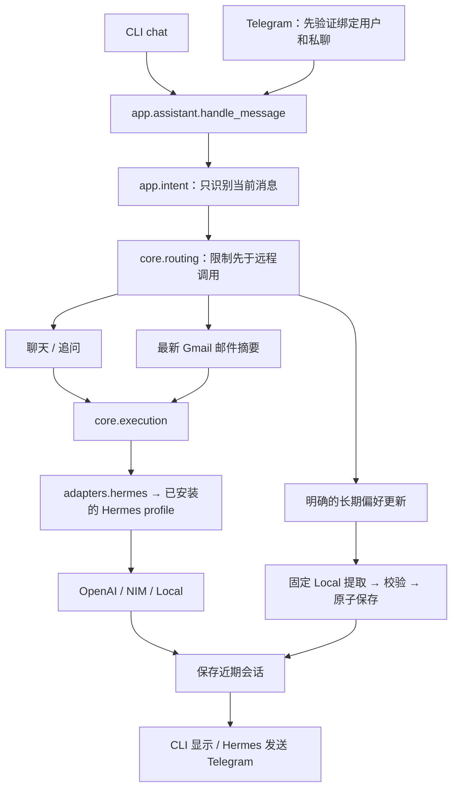

# 架构与代码入口

项目的核心循环已经实现：接收消息 → 识别任务 → 按隐私和复杂度选择模型 → 执行业务 → 保存会话 → 回复。五个职责包直接放在 `src/` 下，不再保留 `hybrid_assistant/` 外层；业务能力共用 `hybrid-assistant` 命令入口。

## 模块职责

| 目录 | 负责什么 | 主要文件 |
| --- | --- | --- |
| `src/cli/` | 参数、错误提示和各入口接线 | `chat.py`、`telegram.py`、`gmail.py`、`memory.py`、`calendar.py` |
| `src/app/` | 单条消息编排、意图识别、近期会话和运行接线 | `assistant.py`、`intent.py`、`conversation.py`、`runtime.py` |
| `src/core/` | 纯元数据路由、按计划调用与回退 | `routing.py`、`execution.py` |
| `src/features/` | 邮件、日历、简报及长期偏好功能 | `email.py`、`calendar.py`、`briefing.py`、`memory.py` |
| `src/adapters/` | 与外部系统交互 | `hermes.py`、`gmail.py`、`calendar_file.py`、`messaging.py`、`telegram.py` |

`core` 不依赖 Hermes、文件系统或网络。业务函数接收注入的模型函数，单元测试可替换这些函数。长期记忆更新固定通过 Local Hermes 提取，再由 Python 校验和写入。入口创建实际依赖并调用业务功能；不同入口不各自重写路由。

## 消息调用链



`app.runtime.create_providers()` 返回惰性的模型函数映射，创建时不读取凭据、不启动模型。识别使用 `load_local_context=False`，业务使用默认配置，仅 Local 加载 USER.md。实际执行失败时，`ProviderError` 才触发计划中明确允许的回退；普通异常不会被吞掉。

已知仅限 Local 的请求在分类前锁定会话私有；分类结果要求 Local 时再次锁定；实际开始 Local 业务回退时也锁定，失败不能重新开放远端。GPT 分类器始终不接收历史、邮件正文、日历或 USER.md。正常公开远端调用成功保持公开；Local 可能引用私人偏好，所以一旦使用就保持私有，直到用户重置。

## 业务与运维入口

`hybrid-assistant` 统一提供 `chat`、`telegram`、`gmail`、`memory`、`calendar`。从仓库根目录也可运行 `python src/main.py`；两个入口都调用 `cli.main()`。对外命令在 `src/cli/` 内实现，不依赖仓库演示脚本。`pyproject.toml` 将五个包一起安装，源码导入直接使用 `from app...`、`from core...` 等路径。

`features.briefing.build_daily_briefing()` 保留日历与邮件组合能力；`build_email_briefing()` 被 Gmail 批量及日报共用。没有继续保留硬编码演示命令，也没有把演示里的固定日期变成产品默认数据。日历从调用者指定的 JSON 文件读取；`config/calendar.example.json` 只是可编辑的非敏感样例。

`scripts/` 保留安装和触发 Windows / Hermes 定时任务的运维脚本。这些脚本安装或启动现有功能，不是新的业务实现。

```text
Windows 08:00 trigger
  → scripts/run_daily_briefing.ps1
  → Hermes hw3-daily-email job
  → profile/scripts/hw3-daily-email.sh
  → hybrid-assistant gmail --daily --send --quiet
```

旧的已安装 launcher 仍指向 `examples/gmail_summary.py`，所以该文件暂留为转发入口，业务逻辑只有一份。新的安装器生成包命令；本次重整不重新安装或启用计划任务。

## 数据所有权

| 内容 | 位置 / 所有者 |
| --- | --- |
| 非敏感默认配置 | 仓库 `config/` |
| 三个实际模型 profile | WSL `~/.hermes/profiles/hw3-openai`、`hw3-nim`、`hw3-local` |
| OAuth、NIM key | Hermes 管理，保留在 WSL home |
| Gmail / Telegram 配置 | Local profile 的 `gmail.json` / `.env` |
| 近期上下文和邮件快照 | Local profile 的 `conversations/` |
| 长期偏好 | Local profile 的 `memories/USER.md` |
| Hermes 原生调用记录 | 各 profile 的 `state.db` |
| Telegram cursor / 单实例锁 | Local profile 的 `telegram-inbound/` |

配置模板不会覆盖已有运行配置。项目不同步三个 Hermes 原生 session，而是自己保存有界的近期上下文。正式 USER.md 已有用户授权写入的偏好，应以实际文件为准。

## 已知边界

分类、生成和保存是独立步骤，无法构成跨网络事务。`conversation_session()` 在正常完成时保存会话；处理失败或 Ctrl+C 中断时，仅保存新锁定的私有状态，不追加成功轮次。若保存失败，CLI 明确提示在修复前继续用 `--private`；Telegram 回复诚实错误提示并停止接收，避免从旧的公开状态继续处理。

长期偏好提交后，即使会话保存或消息发送失败，偏好仍可能已保存；不能假装回滚成功。Telegram cursor 在处理前保存，避免自动重放可能已经执行的操作，代价是崩溃时可能有请求没有回答。

日历定时提醒尚未实现；日历文件摘要不代表已经接入提醒调度。日报也未合并进聊天上下文。更多细节分别见[会话](conversation.md)、[记忆](memory.md)和[Telegram](telegram-inbound.md)说明。